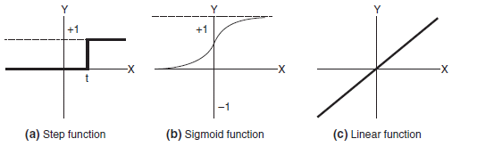
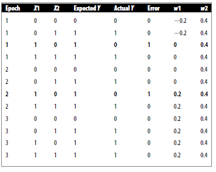
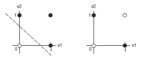
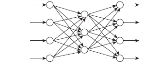

AI PRIMER
=========

Fields 
-------

1.  Philosophy

2.  Linguistics

3.  Psychology

4.  Biology

Definition
----------

1.  The study of systems that act in a way that to any observer would appear to be intelligent.

2.  Using methods based on intelligent behaviour of humans and other animals to solve complex problems.

AI and Methods
--------------

-   Proponents of strong AI believe that a computer that behaves in an intelligent way is capable of possessing mental states and, therefore, of being truly conscious and intelligent the same way that humans are.

-   Weak AI is a less controversial idea – that computers can be programmed to behave intelligently in order to solve specific problems.

-   Weak methods are those that do not rely on any knowledge or understanding of the world and the problems being solved. Most of the techniques described in this book are weak methods.

-   Strong methods are those that use knowledge about the world and the problems being solved. The approach is essential for solving many complex real world problems using ai.

LOGIC
=====

Knowledge bases consist of sentences. These sentences are expressed according to **syntax** of the representation language, which specifies all the sentences that are well formed. The notion of syntax can be exemplified in plain mathematics therefore while “x+y=4” is well formed, “x4y+=” is not.

A logic must also define the **semantics** or meaning of sentences. The semantics defines the **truth** of each sentence with respect to each possible world. In standard logics, every sentence must be either true or false in each possible world and there is no “in-between”.

When we need to be precise, we use the term **model** in place of “possible world”. Whereas possible worlds might be thought of as (potentially) real environments that the agent might or might not be in, models are mathematical abstractions, each of which simply fixes the truth or falsehood of every relevant sentence. Informally, we may think of a possible world as, for example, having x men and y women sitting at a table playing bridge, and the sentence is x+y=4 is true when there are 4 people in total. Formally, the possible models are just all possible assignments of real numbers to variables x and y. each such assignment fixes the truth of any sentence of arithmetic whose variables are x and y. if a sentence α is true in model m, we say that m **satisfies** α or sometimes m **is a model of** α. We use the notation M(α) to mean the set of all models of α.

Now that we have the notion of truth, we can talk about logical reasoning. This involves the relation of logical **entailment** between sentences – the idea that a sentence follows logically from another sentence. In mathematical notation it is written as \(a \vDash \ \beta\) to mean the sentence α entails the sentence β. The formal definition of entailment is this: \(a \vDash \ \beta\) if and only if, in every model in which α is true β is also true. Using the notation introduced we can write: \(a \vDash \ \beta \leftrightarrow M\left( \alpha \right) \subseteq M\left( \beta \right)\). Note the direction of \(\subseteq\) here if\(a \vDash \ \beta\), then α is a stronger assertion than β: it rules out more possible worlds. The relation entailment is familiar from arithmetic; we are happy with the idea that the sentence x=0 entails the sentence xy=0. Obviously, in any model where x is zero, it is the case that xy is zero (regardless of the value of y).

Conclusions in logic are called **logical inferences**. The inference algorithms is called **model checking**, because it enumerates all possible models to check that α is true in all models in which KB is true, that is M(KB)\(\  \subseteq\) M(α).

An inference algorithm that derives only entails sentences called **sound** or **truth preserving**. Soundness is a highly desirable property. An unsound inference procedure essentially makes things up as it goes along – it announces the discovery of the non-existent needless. It is easy to see that model checking, win it is applicable, is a sound procedure.

The property of **completeness** is also desirable: an inference algorithm is complete if it can derive any sentence that is entailed. For real haystacks, which are finite in extent, it seems obvious that a systematic examination can always decide whether the needle is in the haystack. For many knowledge bases, however, the haystack of consequences is infinite, and completeness becomes an important issue. Fortunately, there are complete inference procedures for logics that are sufficiently expressive to handle many knowledge bases.

We have described reasoning process whose conclusions are guaranteed to be true in any world in which the premises are true; in particular, if KB is true in the real world, then any sentence α derived from KB by a sound inference procedure is also true in the real world. So, while an inference process operates on “syntax” – internal physical configurations such as bits in registers or patterns of electrical blips in brains – the process corresponds to the real-world relationship whereby some aspect of the real world is the case by virtue of other aspects of the real world being the case. This correspondence between world and representation is shown below.

The final issue to consider is **grounding –** the connection between logical reasoning process and the real environment in which the agent exists. In particular, who do we know that KB is true in the real world? (After all, KB is just “syntax” inside the agent’s head). That is a philosophical question about which many, many books have been written. A simple answer is that the agent’s sensor create the connection. In smell for example, the agent program creates a suitable sentence whenever there is a smell. Then, whenever that sentence is in the knowledge base it is true in the real world. Thus, the meaning and truth of percept sentences are defined by the processes of sensing and sentence construction that produce them. What about the rest of the agent’s knowledge, such as its belief that wumpuses cause smells in adjacent squares? This is not a direct representation of a single percept, but a general rule – derived, perhaps, from perceptual experience but not identical to a statement of that experience. General rules like this are produced by a sentence construction process called **learning**. Learning is fallible. It could be the case that wumpuses cause smells except on leap year days when they take their bath. Thus, KB may not be true in the real world, but with good learning procedures, there is reason for optimism.

PROPOSITIONAL LOGIC
-------------------

There are a number of possible systems in logic. Propositional logic or calculus deals with a set of logic symbols and notations. The statement ‘it is raining in New York’ having a noun and a verb, may be expressed as N(R) or R(N).

A logical system can be defined in terms of its syntax (the alphabet of symbols and how they can be combined), its semantics (what the symbols mean when constructed correctly) and the set of rules of deduction that enable us to derive an expression from a set of other expressions and thus make arguments and proofs.

### SYNTAX

The alphabet of propositional logic (Σ) is defined as follows

\[\Sigma = \{ true,\ false,\ \neg,\  \rightarrow ,\left( , \right), \land , \vee , \leftrightarrow ,\ p_{1},p_{2},p_{3},\ldots,p_{n},\ldots\}\]

An expression is referred to as a well formed formula (wff) or a sentence if it is constructed correctly, according to the rules of the syntax of propositional calculus, which are defined as follows. In these rules we use A, B, C to represent sentences. In other words, we define a sentence recursively, in terms of other sentences. The following are well-formed sentences:

1.  P, Q, R

2.  True, false

3.  (A)

4.  ¬A

5.  A ˄ B

6.  A ˅ B

7.  A B

8.  A ↔ B

Hence, we can see that the following is an example of a wff:

P ˄ Q ˅ (B ˄ ¬C) A ˄ B ˅ D ˄ (¬E)

This is not to make any claims about the validity or otherwise of the expression, simply that it is allowed within the syntax of propositional calculus.

### TAUTOLOGY

Consider the following truth table:

| A     | A V ¬A |
|-------|--------|
| False | True   |
| True  | True   |

This truth table has a property that we have not seen before: the value of the expression A V ¬A is always true regardless of the value of A. An expression like this that is always true is called a tautology. If A is a tautology we write: \(\vDash\)A.

Tautologies may seem rather like uninteresting entities, but in fact they are very useful for logic.

A logical expression that is tautology is often described as being valid. A valid expression is defined as being one that is true under any interpretation. In other words, no matter what meanings and values we assign to the variables in a valid expression, it will still be true. For example, the following sentences are all valid.

-   If wibble is true, then wibble is true

-   Either wibble is true, or wibble is not true.

In language of logic, we can replace wibble with the symbol A, in which case these two statements now become

-   A A

-   A V ¬A

### CONTRADICTION

If an expression is false in any interpretation, it is described as contradictory. The following expressions are contradictory

-   A ^ ¬A

-   (AV¬A) (A^¬A)

It doesn’t matter what A means in these expressions, the result cannot be true.

### SATISFACTION

Some expressions are satisfiable but not valid. This means that they are true under some interpretation but not under all interpretations. The following expressions are satisfyable.

-   A V B

-   (A^BV¬C) (D^E)

A contradictory expression is clearly not satisfiable and thus is described as being unsatisfiable.

### EQUIVALENCE

Consider the following two expressions: A ^ B and B ^ A. It should be fairly clear that these two expressions will always have the same value for a particular pair of A and B. In other words, we say that the first expression is logically **equivalent** to the second expression. We write this as

\[A \land B \equiv B \land A\]

This means that the ^ operator is commutative.

Note that this is not the same as implication:

\[A \land B \rightarrow B \land A\]

Although this second statement is also true. The difference is that if for two expressions e1 and e2:

\[e1 \equiv e2\]

Then e1 will always have the same value for e2 for a given set of variables. On the other handk, we have seen, \(e1 \rightarrow e2\) is true if e1 is false and e2 is true.

There are a number of logical equivalences that are extremely useful. The following is a fiew of a list of a few of the most common:

1.  \(A \vee A \equiv A\)

2.  \(A \land A \equiv A\)

3.  \(A \land \left( B \land C \right) \equiv \left( A \land B \right) \land C\ \ \left( \land is\ associative \right)\)

4.  \(A \vee \left( B \vee C \right) \equiv \left( A \vee B \right) \vee C\ \ \left( \vee is\ associative \right)\)

5.  \(A \land \left( B \vee C \right) \equiv \left( A \land B \right) \vee (B \land C)\ \ \left( \land is\ distributive\ over \vee \right)\)

6.  \(A \land \left( B \vee C \right) \equiv A\ \ \)

7.  \(A \vee \left( B \land C \right) \equiv A\ \ \)

8.  \(A \land true \equiv A\ \ \)

9.  \(A \land false \equiv false\ \ \)

10. \(A \vee true \equiv true\ \ \)

11. \(A \vee false \equiv A\ \)

All of these equivalences can be proved by drawing up the truth tables for each side of the equivalence and seeing if the two tables are the same. You may want to try this to satisfy yourself that all of the equivalences are correct. The following gives a very important equivalence

\[A \rightarrow B \equiv \neg A \vee B\]

You can verify this by checking truth tables. The reason that this is useful is that it means we do not need to use symbol at all – we can replace it with a combination of ¬ and V. Similarly, the following equivalences mean that we do not need to use ^ or &lt;-&gt;:

\[A \land B \equiv \neg\left( \neg A \vee \neg B \right)\]

\[A \leftrightarrow B \equiv \neg\left( \neg\left( \neg A \vee B \right) \vee \neg\left( \neg B \vee A \right) \right)\]

In fact, any binary logical operator can be expressed using ¬ and V. This is a fact that is employed in electronic circuits, where nor gates, based on an operator called nor are used.

### SEMANTICS

The semantics of operators of propositional calculus can be defined in terms of truth tables. As we have seen, the meaning of P ˄ Q is defined as “true when P is true and Q is also true”.

The meaning of symbols such as P and Q is arbitrary and could be ignored altogether if we were reasoning about pure logic. In other words, reasoning about sentences such as P ˄ Q ˅ ¬R is possible without considering what P, Q and R mean.

Because we are using logic as a representational method for artificial intelligence, however, it is often the case that when using propositional logic, the meanings of this symbols are important. The beauty of this representation is that it is possible for a computer to reason about them in a very general way, without needing to know much about the real world.

In other words, if we tell a computer “I like ice cream, and I like chocolate”, it might represent this statement as A ˄ B, which it could then use to reason with, and, as we will see, it can make deductions.

FIRST ORDER LOGIC
-----------------

TYPES OF LOGIC (WORLD (ONTOLOGICAL) OR BELIEFS (EPISTEMOLOGICAL))

1.  PROPOSITIONAL LOGIC (T, F) - LIMITED BY UNCERTAINTY, OBJECTS, SHORTCUTS (model=value for each propositional symbol either true or false)

2.  PROBABILITY THEORY (0..1)

3.  FIRST ORDER LOGIC

REPRESENTATIONS

1.  ATOMIC

2.  FACTORED (T,F, 0..1)

3.  STRUCTURED OBJECTS, RELATIONS, CONDITIONS, FOL

FOL

1.  USES A MODEL:

    1.  OBJECTS: set of symbols for objects

    2.  CONSTANTS: literal symbols

    3.  FUNCTIONS: Mapping from objects to objects

    4.  RELATIONS: returns a set of tuples with true values satisfying the relation

2.  USES SYNTAX

    1.  SENTENCES

    2.  OPERATORS

    3.  TERMS

    4.  QUANTIFIERS

### SYNTAX

Predicate calculus allows us to reason about properties of objects and relationships between objects. In propositional calculus, we could express the English statement “I like cheese” by A. This enables us to create constructs such as ¬A, which means “I do not like cheese”, but it does not allow us to extract information about the cheese, or me, or other things that I like.

In predicate calculus, we use predicates to express properties of objects. So, the sentence “I like cheese” might be expressed as: L(me, cheese), where L is a predicate that represents the idea of “liking”. Note that as well as expressing a property of me, this statement also expresses a relationship between me and cheese. So, for example, a simple agent may be concerned with the location of various blocks, and a statement about the world might be:

T(A,B)

Which could mean: Block A is on top of block B.

Thus far we have expressed ideas about specific objects. It is also possible to make more general statements using predicate calculus. For example to express the idea that everyone likes cheese, we might say

\[\left( \forall x \right)\left( P\left( x \right) \rightarrow L\left( x,C \right) \right)\]

The symbol \(\forall\) is read “for all”, so the statement above could be read as “for every x it is true that if property P holds for x, then the relationship L holds between x and C”, or in plainer English: “every x that is a person likes cheese”. (Here we are interpreting P(x) as meaning “x is a person” or, more precisely “x has property P”.) \(\forall\) is called the universal quantifier.

The quantifier \(\exists\) can be used to express the notion that some values have a certain property, but not necessarily all of them.

\[\left( \exists x \right)\left( L\left( x,C \right) \right)\]

This statement can be read “there exists an x such that x likes cheese.” This does not make any claims about the possible values of x, so x could be a person, or dog, or item of furniture. When we use the existential quantifier in this way, we are simply saying that there is at least one value of x for which L(x,C) holds.

Note, therefore, that the following is true:

\[\left( \forall x \right)\left( L\left( x,C \right) \right) \rightarrow \left( \exists x \right)\left( L\left( x,C \right) \right)\]

But the following is not:

\[\left( \exists x \right)\left( L\left( x,C \right) \right) \rightarrow \left( \forall x \right)\left( L\left( x,C \right) \right)\]

### RELATIONSHIP BETWEEN Ǝ AND \(\forall\)

It is also possible to combine the universal and existential quantifiers, such as in the following statement:

\[\left( \forall x \right)\left( \exists y \right)\left( L\left( x,y \right) \right)\]

This statement can be read “for all x, there exists a y such that L holds for x and y,” which we might interpret as “everyone likes something”.

A useful relationship exists between \(\forall\) and Ǝ. Consider the statement “not everyone likes cheese”. We could write this as

\[\neg\left( \forall x \right)\left( P\left( x \right) \rightarrow L\left( x,C \right) \right)\ \ \ \ \ \ \ldots.\ \ \ \ \ \left( 1 \right)\]

As we have already seen, A B is equivalent to ¬AvB. Using DeMorgan’s laws, we can see that this is equivalent to ¬(A^¬B). Hence, the statement(1) above, can be rewritten:

\[\neg\left( \forall x \right)\neg(P\left( x \right) \land \neg L(x,C))\ \ \ \ \ \ldots\ \ \ \ \ (2)\]

This can be read as “It is not true that for all x for the following is not true: x is a person and x does not like cheese.” If you examine this rather convoluted sentence carefully, you will see that it is in fact the same as “there exists an x such that x is a person and x does not like cheese.” Hence we can rewrite it as

\[\left( \exists x \right)\left( P\left( x \right) \land \neg L\left( x,C \right) \right)\ \ \ \ldots\ \ \ \left( 3 \right)\]

In making this transition from (2) to statement (3), we have utilized the following equivalence:

\[\forall x \equiv \neg\left( \forall x \right)\neg\]

In an expression of the form \(\left( \forall x \right)\left( P\left( x,y \right) \right)\), the variable x is said to be bound, whereas y is said to be free. This can be understood as meaning that the variable y could be replaced by any other variable because it is free, and the expression would still have the same meaning, whereas if the variable x were to be replaced by some other variable in P(x,y), then the meaning of the expression would be changed:

\[\left( \forall x \right)\left( P\left( y,z \right) \right)\]

Is not equivalent to \(\left( \forall x \right)\left( P\left( x,y \right) \right)\), whereas \(\left( \forall x \right)\left( P\left( x,z \right) \right)\) is. Note that a variable can occur both bound and free in an expression, as in

\[\left( \forall x \right)\left( P\left( x,y,z \right) \rightarrow \left( \exists y \right)\left( Q\left( y,z \right) \right) \right)\]

In this expression, x is bound throughout, and z is free throughout; y is free in its first occurrence but is bound in (Ǝy)(Q(y,z)). (Note that both occurrence of y are bound here.)

Making this kind of change is known as substitution. Substitution is allowed of any free variable for another free variable.

### FUNCTIONS

Functions can take more than one argument, and in general a function with n arguments is represented as

\[f\left( x_{1},x_{2},\ x_{3},\ \ldots,\ x_{n} \right)\]

FIRST ORDER PREDICATE LOGIC
---------------------------

The type of predicate calculus in the previous section is called first order predicate logic (FOPL). A first-order logic is one in which the quantifiers \(\forall\) and Ǝ can be applied to objects or terms, but not to predicates or functions. So we define the syntax of FOPLS as follows. First, we define a term:

1.  A constant term

2.  A variable term

3.  F(x1,x2,x3,…,xn) is a term if x1, x2, x3, … ,xn are terms

Anything that does not meet the above description cannot be a term. For example, the following is not a term: \(\forall xP\left( x \right)\). This kind of construction we call a sentence or a well-formed formula (wff), which is defined as follows. In these definitions, P is a predicate, x1, x2, x3, … , xn are terms, and A, B are wff’s. The following are acceptable forms of wff’s:

1.  P(x1, x2, x3, … , xn)

2.  ¬A

3.  AVB

4.  A^B

5.  AB

6.  A&lt;-&gt;B

7.  (\(\forall\)x)A

8.  (Ǝx)A

9.  An atomic formula is a wff of the form P(x1, x2, x3, … , xn)

Higher order logics exists in which quantifiers can be applied to predicates and functions, and where the following expression is an example of a wff:

\[\left( \forall P \right)\left( \exists x \right)P\left( x \right)\]

### SOUNDNESS

We have seen that a logical system such as propositional logic consists of syntax, semantics, and a set of rules of deduction. A logical system also has a set of fundamental truths, which are known as axioms. The axioms are the basic rules that are known to be true and from which all other theorems can be proved.

PROBABILITY
===========

P(A)=p , P(¬A)=1-p

INTER DEPENDENCE
----------------

\[P\left( A \right)\bot P\left( B \right) = P\left( A|B \right)P\left( B \right) = P(A,B)\]

TOTAL PROBABILITY
-----------------

\[P(Y) = \sum_{i}^{}{P\left( Y|X = i \right)P\left( X = i \right)}\]

P(¬X|Y)=1-(X|Y) {negation}

BAYES RULE
----------

\[P\left( A \middle| B \right)\lbrack Posterior\rbrack = \frac{P\left( B \middle| A \right)\left\lbrack \text{likelyhood} \right\rbrack \times \ P\left( A \right)\lbrack prior\rbrack}{P\left( B \right)\ \lbrack marginal\ likelyhood = total\ probability\rbrack}\]

MARKOV MODELS
-------------

A probability phenomena based on dependent probability such that the probability of one event is dependent on the likelihood of another event also known as the evidence. If the dependent probability also has another dependent then a markov model is formed. This is represented as

\[P\left( w_{n}|w_{n - 1},w_{n - 2},\ldots w_{1} \right)\ \ \ \ldots\ \ \ \ \ \left( 1 \right)\]

A simplified markov model is based on the first-order assumption that

\[P\left( w_{n}|w_{n - 1},w_{n - 2},\ldots w_{1} \right) = P\left( w_{n}|w_{n - 1} \right)\ \ \ \ldots\ \ \ \ \ \left( 2 \right)\]

And a second-order assumption is

\[P\left( w_{n}|w_{n - 1},w_{n - 2},\ldots w_{1} \right) = P\left( w_{n}|w_{n - 1},w_{n - 2} \right)\ \ \ \ldots\ \ \ \ \ \left( 3 \right)\]

### JOINT PROBABILITY

Based upon markov first order assumption is given s

\[P\left( w_{1},\ldots w_{n} \right) = \prod_{i = 1}^{n}\left( w_{i}|w_{i - 1} \right)\ \ \ \ldots\ \ \ \ \ \left( 4 \right)\]

Note that while Total probability signifies alternate routes or a parallel occurrences in a co-planar order model, and the joint probability signifies serial occurrences on a co-planar order model, the markov order model signifies an n dimensional dependency order that is non-coplanar.

#### EXAMPLE

Given that today is foggy, what’s the probability that it will be rainy two days from now?

Given the following chain

|                 |       | Tomorrow’s weather |
|-----------------|-------|--------------------|
|                 |       | Sunny              |
| Today’s weather | Sunny | 0.8                |
|                 | Rainy | 0.2                |
|                 | Foggy | 0.2                |

#### SOLUTION

There are three ways to get to foggy today to rainy two days from today. (1)Foggy, foggy, rainy; (2) foggy, rainy, rainy; (3) foggy, sunny, rainy. Therefore we add up the three paths:

\[P\left( w_{3} = Rainy|w_{1} = foggy \right) = P\left( r,f \middle| f \right) + P\left( r,r \middle| f \right) + P\left( r,s \middle| f \right)\ \ldots..\ \ \ \ \left( 5 \right)\]

but from equation (2)&(4)

\[P\left( r,f \middle| f \right) = P\left( f \middle| f \right)*P(r|f,f) = P\left( f \middle| f \right)*P(r|f)\]

\[P\left( r,r \middle| f \right) = P\left( r \middle| f \right)*P(r|r,f) = P\left( r \middle| f \right)*P(r|r)\]

\[P\left( r,s \middle| f \right) = P\left( s \middle| f \right)*P(r|s,f) = P\left( s \middle| f \right)*P(r|s)\]

Therefore equation (5) becomes

\[P\left( w_{3} = r|w_{1} = f \right) = \left\lbrack P\left( f \middle| f \right)P\left( r \middle| f \right) \right\rbrack + \left\lbrack P\left( r \middle| f \right)P\left( r \middle| r \right) \right\rbrack + \lbrack P\left( s \middle| f \right)P\left( r \middle| s \right)\rbrack\ldots..\ \ \ \ \left( 6 \right)\]

\[P\left( w_{3} = r|w_{1} = f \right) = 0.5 \times 0.3 + 0.3 \times 0.6 + 0.2 \times 0.05 = 0.34\]

HIDDEN MARKOV MODELS
--------------------

So what makes a Hidden Markov Model? Suppose one was locked in a room for several days and was asked about the weather outside. The only piece of evidence you have is whether the person who comes into the room carrying your daily meal is carrying an umbrella or not. Let’s suppose the following probabilities

|                 |       | Tomorrow’s weather |
|-----------------|-------|--------------------|
|                 |       | Sunny              |
| Today’s weather | Sunny | 0.8                |
|                 | Rainy | 0.2                |
|                 | Foggy | 0.2                |

|       | Probability of Umbrella |
|-------|-------------------------|
| Sunny | 0.1                     |
| Rainy | 0.8                     |
| Foggy | 0.3                     |

The equation for the Markov Model is given as

\[P\left( w_{1},\ \ldots,\ w_{n} \right) = \prod_{i = 1}^{n}{P\left( w_{i} \middle| w_{i - 1} \right)}\ \ldots.\ \ \ \left( 5 \right)\]

Now we have to factor in the fact that the actual weather is hidden from you. We do this by using Bayes’ rule

\[P\left( w_{1},\ \ldots,\ w_{n}|\ u_{1},\ \ldots,\ u_{n} \right) = \frac{P\left( u_{1},\ \ldots,\ u_{n} \middle| w_{1},\ \ldots,\ w_{n} \right)P\left( w_{1},\ \ldots,\ w_{n} \right)}{P\left( u_{1},\ \ldots,\ u_{n} \right)}\ \ldots.\ \ \ \ \ \left( 6 \right)\]

Where ui is true if your caretaker brought an umbrella on day i, and false if the care take the care taker didn’t. The probability (w1, … ,wn) is the same as the Markov model and the probability P(u1,…,un) is the prior probability of seeing a particular sequence of umbrella events (e.g. {True, False, True}). The probability \(P\left( u_{1},\ \ldots,\ u_{n} \middle| w_{1},\ \ldots,\ w_{n} \right)\) can be estimated as \(\prod_{i = 1}^{n}\left( u_{i}|w_{i} \right)\) if you assume that, for all i, given ui is independent of all uj and wj, for all j≠i.

#### EXAMPLE 

Suppose the day you were locked in it was sunny. The next day, the caretaker carried an umbrella into the room. Assuming that the prior probability of the caretaker carrying an umbrella on any day is 0.5, what’s the probability that the second day was rainy?

#### SOLUTION

\[\left( \text{Baye}s^{'}\text{Rule} \right) = \frac{P\left( u_{2} = T \middle| w_{1} = s,w_{2} = r \right)P\left( w_{2} = r,w_{1} = s \right)}{P\left( w_{1} = s \right)P\left( u_{2} = T \right)}\]

\[\left( \text{Markov\ Assumption} \right) = \frac{P\left( u_{2} = T \middle| w_{1} = s \right)P\left( w_{2} = r,w_{1} = s \right)}{P\left( w_{1} = s \right)P\left( u_{2} = T \right)}\]

\[\left( Inter - dependence \right) = \frac{P\left( u_{2} = T \middle| w_{1} = s \right)P\left( w_{2} = r|w_{1} = s \right)P(w_{1} = s)}{P\left( w_{1} = s \right)P\left( u_{2} = T \right)}\]

\[\left( cancel\ P(w_{1} = s \right) = \frac{P\left( u_{2} = T \middle| w_{1} = s \right)P\left( w_{2} = r|w_{1} = s \right)}{P\left( u_{2} = T \right)}\]

\[P\left( w_{2} = r \middle| w_{1} = s,u_{2} = T \right) = \frac{\left( 0.8 \right)\left( 0.05 \right)}{0.5} = 0.08\]

PROBABILITY SUMMARY
-------------------

-   Probabilistic reasoning uses a notation similar to first-order predicate calculus, but with the addition of terms such as P(A)=0.5, which states that the probability that A is true (or that A will occur) is 0.5.

-   Conditional probability is defined as

\[P\left( B \middle| A \right) = \frac{P\left( B \land A \right)}{P\left( A \right)}\]

-   This means the probability that B will occur, given that we already know A.

-   The joint probability distribution (or joint) is used to represent probabilities concerning more than one variable.

-   Bayes’ theorem can be used to determine the posterior (conditional) probability

\[P\left( B \middle| A \right) = \frac{P(A|B)P\left( B \right)}{P\left( A \right)}\]

-   Bayesian concept learning involves selecting the most likely hypothesis to explain a piece of data, using Bayes’ theorem to calculate posterior probabilities.

-   A Bayesian belief network is an acyclic directed graph, where the nodes in the graph represent evidence of hypotheses, and where an arc that connects two nodes represents a dependence between those two nodes.

-   Bayes’ optimal classifier uses Bayes’ theorem to learn to classify items of data. No other classifier can perform better than the optimal classifier, on average.

-   The naïve Bayes classifier uses the simplifying assumption that all the variables used to represent data for classification are independent of each other.

-   Collaborative filtering is used to guess an individual’s likes or dislikes based on prior information about other interests. One very successful method for collaborative filtering is to build a Bayesian belief network, based on a set of decision trees.

MACHINE LEARNING
================

SUMMARY
-------

1.  Many learning methods use some form of training to learn to generalise from a set of pre-classified training data to be able to correctly classify unseen data.

2.  **Rote learning** involves simply memorizing the classification of training data. A rote learning system is not able to generalise and so is only able to classify already seen data.

3.  A general-to-specific ordering of hypotheses can be used to learn to generalise from a set of training data to a hypothesis that matches all input data. This is known as **concept learning**.

4.  A version space, which consists of all possible hypotheses that match as set of training data can be used to generalize from those training data to learn to classify unseen data.

5.  **Candidate elimination** is a method that uses the general-to-specific ordering to produce a set of hypotheses that represent the entire version space for a problem.

6.  The inductive bias of a learning method is the assumptions it makes about possible hypotheses that can be used. A learning system with no inductive bias is capable of generalising beyond the training data it is given.

7.  Decision-tree induction can be used to learn a decision tree that will correctly classify a set of input data. The inductive bias of decision-tree induction is to prefer shorter trees.

8.  The problem of over-fitting occurs when there is noise in the training data that causes a learning method to develop a hypothesis that correctly matches the training data but does not perform well on other input data.

9.  The nearest neighbour algorithm simply memorizes the classification of the training data, and when presented with a new piece of data gives the majority answer given by the closest neighbours to this piece of data in n-dimensional space.

10. Neural networks are based on biological networks of neurons contained within the human brain.

11. Supervised learning methods learn from manually classified data.

12. Unsupervised learning methods such as Kohonen maps learn without any manual intervention.

13. A system that uses reinforcement learning is given a positive reinforcement when it performs correctly. Credit and blame assignment are important features of such methods.

NEURAL NETWORKS
===============

The human brain has a property called plasticity, which allows neurons to change the nature and number of their connections to other neurons in response to events that occur. In this way, the brain is able to learn. The brain uses a form of credit assignment to strengthen connections between neurons that that lead to correct solutions to problems and weakens connections that lead to incorrect solutions. The strength of a connection or synapse, determines how much influence it will have on the neurons to which it is connected, and so if a connection is weakened, it will play less of a role in subsequent computations.

A form of artificial neurons are known as the McCulloch and Pitts neurons. Artificial neurons tend to have fewer connections than biological neurons. Each neuron (or node) in a neural network receives a number of inputs. A function called the activation function is applied as to these input values which results in the activation level of the neuron, which is the output of the neuron. There are a number of possible functions that can be used in neurons. Some of the most commonly used activation functions are illustrated below.

One of the most commonly used function is the step functions, or linear threshold function. In using this function, the inputs to the neuron are summed (having each been multiplied by a weight), and this sum is compared with a threshold, t. If the sum is greater than the threshold, then the neuron fires and has an activation level of +1. Otherwise, it is inactive and has an activation level of zero. (In some networks, when the sum does not exceed the threshold, the activation level is considered to be -1 instead of 0).

Hence, the behaviour of the neuron can be expressed as follows:

\[X = \sum_{i = 1}^{n}{w_{i}x_{i}}\]

X is the weighted sum of the n inputs to the neuron, x1 to xm, where each input, x­n is multiplied by its corresponding weight wn. For example, let us consider a simple neuron that has just two inputs. Each of these inputs has a weight associated with it, as follows:

W1 = 0.8

W2 = 0.8

The inputs to the neuron are x1 and x2:

x1 = 0.7

x2 = 0.9

So, the summed weight of these inputs is

\[\left( 0.8 \times 0.7 \right) + \left( 0.4 \times 0.9 \right) = 0.92\]

The activation level Y, is defined for this neuron as

\[Y = \left\{ \begin{matrix}
 + 1\ for\ X > t \\
0\ for\ X \leq t \\
\end{matrix} \right.\ \]

Hence, if t is less than or equal to 0.92, then this neuron will fire with this particular set of inputs. Otherwise, it will have an activation level of zero.

A neuron that uses the linear activation function simply uses the weighted sum of its inputs as its activation level. The sigmoid function converts inputs from a range of -∞ to +∞ into an activation level in the range of 0 to +1.

A neuron network consists of a set of neurons that are connected together. Later in this chapter we explore the ways in which neurons are usually connected together. The connections between neurons have weights associated with them, and each neuron passes its output on the inputs of the neurons to which it is connected. This output depends on the application of the activation function to the inputs it receives, in this way, an input signal to the network is processed by the entire network and an output (or multiple outputs) produced. There is no central processing or control mechanism – the entire network is involved in every piece of computation that takes place.

The way in which neurons behave over time is particularly interesting. When an input is given to a neural network, the output does not appear immediately because it takes some finite period of time for signals to pass from one neuron to another. In artificial neural networks this time is usually very short, but in the human brain, neural connections are surprisingly slow. It is only enormously parallel nature of the brain that enables it to calculate so quickly.

For neural networks to learn, the weight associated with each connection (equivalent to a synapse in the biological brain) can be changed in response to particular events. Hebian learning involves increasing the weight of a connection between two neurons if both neurons fire at the same time.

PERCEPTRONS
-----------

The perceptrons, first proposed by Rosenblatt (1958), is a simple neuron that is used to classify its inputs into one of two categories.

The perceptron can have any number of inputs, which are sometimes arranged into a grid. This grid can be used to represent an image, or a field of vision, and so perceptrons can be used to carry out simple image classification or recognition tasks.

A perceptron uses a step function that returns +1 fi the weighted sum of the inputs, X, is greater than a threshold, t, and 0 if X is less than or equal to t:

\[X = \sum_{i = 1}^{n}{w_{i}x_{i}}\]

\[Y = \left\{ \begin{matrix}
 + 1\ \ for\ X > t \\
0\ \ \ for\ X \leq t \\
\end{matrix} \right.\ \]

In which case, the activation function for a perceptron can be written as

\[Y = Step\left( \sum_{i = 1}^{n}{w_{i}x_{i}} \right)\]

Note that we here have allowed i to run from 0 instead of 1. This means we have introduced two new variables w0 and x0. We define x0 as 1, and w0 as –t.

A single perceptron can be used to learn a classification task, where it receives an input and classifies it into one of two categories. 1 or 0. We can consider these to represent true and false, in which case the perceptron can learn to represent a Boolean operator such as AND or OR.

The learning process for a perceptron is as follows:

First, random weights are assigned to the inputs. Typically, these weights will be chosen between -0.5 and +0.5.

Next, an item of training data is presented to a perceptron, and its output classification observed. If the output is incorrect, the weights are adjusted to try to more closely classify this input. In other words, if the perceptron incorrectly classifies a positive piece of training data as negative, then the weights need to be modified to increase the output for that set inputs. This can be done by adding a positive value to the weight of an input that had a negative input value, and vice versa.

The formula for this modification, as proposed by Rosenblatt (Rosenblatt, 1958) is as follows:

\[w_{i} \leftarrow w_{i} + \left( a \times x_{i} \times e \right)\]

Where e is the error that was produced, and a is the learning rate, where 0&lt;a&lt;1; e is defined as 0 if the output is correct, and otherwise it is positive if the output is too low and negative if the output is too high. In this way if the output is too high, a decrease in weight is caused for an input that received a positive value. This rule is known as the **perceptron training rule**.

Once this modification to the weights has taken place, the next piece of training data is used in the same way. Once all the training data have been applied, the process starts again, until the weights are correct and all errors are zero. Each training process is called an **epoch**.

Let us examine a simple example; we will see how a perceptron can learn to represent the logical-OR function for two input units. We will use a threshold of zero (t=0) and a learning rate of 0.2.

First, the weight associated with each of the two inputs is initialised to a random value between-1 and +1:

\[w_{1} = - 0.2\]

\[w_{2} = 0.4\]

Now, the first epoch is run through. The training data will consist of the four combinations of 1’s and 0’s possible with two inputs.

Hence, our first piece of training data is

\[x1 = 0,\ x2 = 0\]

And our expected output is x1 OR x2 = 0.

We apply the formula for Y:

\[Y = Step\left( \sum_{i = 1}^{n}{w_{i}x_{i}} \right)\]

\[= Step\left( \left( 0 \times - 0.2 \right) + \left( 0 \times 0.4 \right) \right) = 0\]

Hence, the output Y is as expected, and the error, e, is therefore 0. So the weights do not change.

Now for x1=0 and x2=1:

\[Y = Step\left( \left( 1 \times - 0.2 \right) + \left( 0 \times 0.4 \right) \right) = Step\left( - 0.2 \right) = 0\]

This is incorrect because 1 OR 0 = 1, so we should expect Y to be 1 for this set of inputs. Hence, the weights are adjusted.

We will use the perception training rule to assign new values to the weights:

\[w_{i} \leftarrow w_{i} + \left( a \times x_{i} \times e \right)\]

Our learning rate is 0.2, and in this case, the e is 1, so we will assing the following value to w1:

\[w1 = - 0.2 + 0.2 \times 1 \times 1) = - 0.2 + 0.2 = 0\]

We now use the same formula to assign a new value to w2:

\[w2 = 0.4 + \left( 0.2 \times 0 \times 1 \right) = 0.4\]

Because w2 did not contribute to this error, it is not adjusted. The final piece of training data is now used (x1 = 1 and x2=1):

\[Y = Step\left( \left( 0 \times 1 \right) + \left( 0.4 \times 1 \right) \right) = Step\left( 0 + 0.4 \right) = Step\left( 0.4 \right) = 1\]

This is correct, and so the weights are not adjusted.

This is the end of the first epoch, and at this point the method runs again and continues to repeat until all four pieces of training data are classified correctly.

Table A sample run showing how weights change for a simple perceptron when it learns to represent the logical OR function.

From Table 1, it takes just 3 epochs for the perceptron to correctly learn to classify the input values. Error values are shown in bold.

After just three epochs, the perception learns to correctly model the logical OR function.

In the same way, a perceptron can be trained to model other logical functions such as AND, but there are some functions that cannot be modeled using a perceptron, such as exclusive OR.

The reason for this is that perceptrons can only learn to model functions that are **linearly separable**. A linearly separable function is one that can be drawn on a two-dimensional graph. And a single straight line can be drawn between the values so that inputs that are classified into one classification are on one side of the lines, and inputs that are classified into the other on the other side of the line.

Figure Differnce between lineary separable and non-linearly separable functions

Four points are plotted on each graph, and a solid dot represents true, and a hollow dot represents false. It should be clear that no dashed line could be drawn in the second case, for the exclusive OR function, that would separate the solid dots from the hollow ones.

The reason that a single perceptron can only model functions that are linearly separable can be seen by examining the following function:

\[X = \sum_{\left( i = 1 \right)}^{n}{w_{i}x_{i}}\]

\[Y = \left\{ \frac{+ 1\ for\ X > t}{- 1\ for\ X \leq t} \right.\ \]

Using these functions, we are efficiently dividing the search space using a line which X=t. Hence, in a perceptron with two inputs, the line that divides one class from the other is defined as follows:

\[w_{1}x_{1} + w_{2}x_{2} = t\]

The perceptron functions by identifying a set of values for \(w_{i}\) which generates a suitable function. In cases where no such linear function exists, the perceptron cannot succeed.

MULTILAYER NETWORKS
-------------------

Most real-world problems are not linearly separable, and so although perceptrons are an interesting model for studying the way in which artificial neural network can work, something more powerful is needed.

As has already been indicated, neural networks consist of a number of neurons that are connected together, usually in arranged layers.

Figure A simple three-layer feed forward neural network

A single perceptron can be thought of as a single-layer perceptron. Multi-layer perceptron are capable of modeling more complex functions, including ones that are not linearly separable, such as exclusive-OR, note that the functions NOR and NAND are both linearly separable and so can be represented by a single perceptron in just two layers, and binary function of two inputs can be generated.

A typical architecture for a multilayer neural network is shown in Figure 2 above. The network is a feed-forward network, consisting of three layers. The first layer is the input layer. Each node (or neuron) in this layer receives a single input signal. In fact, it is usually the case that the nodes in this layer are not neurons, but simply to act to pas input signals on to the nodes in the next layer, which is in this case a hidden layer.

A network can have one or more hidden layers, which contain the neurons that do the real work. Note that each input signal is passed to each of the nodes in this layer and that the output of each node in this layer is passed to each node in the subsequent layer, which in this case is the output layer. The output layer carries out final stage of processing and sends out output signals.

The network is called a feed-forward because data are fed from the input nodes through to the output nodes. This is in contrast with recurrent networks, where some data are passed back from output nodes to the input nodes.

A typical feed-forward neural network consists of an input-layer, one or more hidden layers and an output layer, and may have anywhere between 10 and 1000 neurons in each layer.

### BACK PROPAGATION

Multilayer neural networks learn in much same way as single perceptrons. The main difference is that in a multilayer network, each neuron has weights associated with its inputs, and so there are far greater number of weights to be adjusted when an error is made with a piece of training data. Clearly, an important question is how to assign blame (or credit) to the various weights. One method that is commonly used is back-propagation.

Rather than using the simple step function that single perceptrons use, multilayer back-propagation networks usually use the sigmoid function.

The sigmoid function is defined as follows

\[\sigma\left( x \right) = \frac{1}{1 + e^{- x}}\]

This function is easy to differentiate because

\[\frac{\text{dσ}\left( x \right)}{\text{dx}} = \sigma\left( x \right)\left( 1 - \sigma\left( x \right) \right)\]

This is in contrast with step function used by perceptrons which has no simple derivative.

As with the single perceptron, the back-propagation algorithm starts by initializing the weights in the network to random values, which are usually set to small values, say in the range of -0.5 to 0.5. Alternatively, the weights can be normally distributed over -2.4/n to 2.4/n, where n is the number of inputs to the input layer.

Each iteration of the algorithm involves first feeding data through the network from inputs to outputs. The next phase, which gives the algorithm its name, involves feeding errors back from outputs to the inputs. These error values feedback through the network, making changes to the weights of nodes along the way. The algorithm repeats in this way until the outputs produced for the training data are sufficiently close to the desired values-in other words, until the error values are sufficiently small.

Because the sigmoid function cannot actually reach 0 or 1, it is usual to accept a value such as 0.9 as representing 1 and 0.1 as representing 0.

Now we shall see the formulae that are used to adjust the weights in the back-propagation algorithm. We will consider a network of three layers and will use I to represent nodes in the input layer, j to represent nodes in the hidden layer, and k to represent nodes in the output layer. Hence, for example, wij refers to the weight of a connection between a node in the input layer and a node in the hidden layer.

The function that is used to derive the output value for the nod j in the network is as follows:

\[X_{j} = \sum_{i = 1}^{n}{x_{i}w_{\text{ij}} - \theta_{j}}\]

\[Y_{j} = \frac{1}{1 + e^{{- X}_{j}}}\]

Where n is the number of inputs to node j; wij is the weight of the connection between node i and node j; θj is the threshold value being used for nod j, which is set to a random value between 0 and 1; xi is the input value for input node I; and yj is the output value produced by node j.

Once the inputs have been fed through the network to produce outputs, an error gradient is calculated for each node k in the output layer.

The error signal for k is defined as the difference between the desire value and the actual value for that node:

\[e_{k} = d_{k} - y_{k}\]

dk is the desired value for node k, and yk is the actual value, in this iteration.

The error gradient for output node k is defined as the error value for this node multiplied by the derivative of the activation function:

\[\delta_{k} = \frac{\partial y_{k}}{\partial x_{k}}e_{k}\]

xk is the weighted sum of the input values to the node k.

Because y is defined as a sigmoid function of x, we can use the formula that was given above for the derivative of the sigmoid function to obtain the following formula for the error gradient:

\[\delta_{k} = y_{k}\left( 1 - y_{k} \right)e_{k}\]

Similarly, we calculate an error gradient for each node in the hidden layer, as follows;

\[\delta_{j} = y_{j}\left( 1 - y_{j} \right)\sum_{k = 1}^{n}{w_{\text{jk}}\delta_{k}}\]

Where n is the number of nodes in the output layer, and thus the number of outputs from each node in the hidden layer.

Now each weight in the network, w­ij or wjk, is updated according to the following formula:

\[w_{\text{ij}} \leftarrow w_{\text{ij}} + \alpha x_{i}\delta_{j}\]

\[w_{\text{jk}} \leftarrow w_{\text{jk}} + \alpha y_{j}\delta_{k}\]

Where xi is the input value to the input node i, and α is the learning rate, which is a positive number below 1, and which should not be too high.

This method is known as gradient descent because it involves following the steepest path down the surface that represents the error function to attempt to find the minimum in the error space, which represents the set of weights that provides the best performance of the network.

In fact, the iteration of the back-propagation algorithm is usually terminated when the sum of of the squares of the errors of the output values for all training data is less than some threshold, such as 0.001.

Note that this method assigns blame to individual nodes within the network by comparing the weights attached to each node with the error associated with that node. In the case of hidden nodes, there is no error value because there is no specific desired output value for these nodes. In this case, the weight of each connection between a hidden layer node an and output node is multiplied by the error of that output node to attempt to distribute the blame between nodes in the hidden layer according to how much each one contributes to the error.

Unlike Hebbian learning, back propagation does not appear to occur in the human brain. Additionally, it is rather inefficient and tends to be slow for us in solving real-world problems. With some simple problems it can take hundreds or even thousands of epochs to reach a satisfactorily low level of error.

#### IMPROVING BACK-PROPAGATION PERFORMANCE

A common method used to improve the performance of back-propagation is to include momentum in the formula that is used to modify the weights. The momentum takes into account the extent to which a particular weight was changed on the previous iteration. We shall use t to represent the current iteration and t-1 the previous iteration. Hence, we can write out our learning rules as follows:

\[\Delta w_{\text{ij}}\left( t \right) = a.x_{i}d_{j} + \beta\Delta w_{\text{ij}}\left( t - 1 \right)\]

\[\Delta w_{\text{jk}}\left( t \right) = a.y_{i}d_{k} + \beta\Delta w_{\text{jk}}\left( t - 1 \right)\]

Δwij(t) is the amount that is added to the weight of the connection between nodes i and j, wij at iteration t; β is the momentum value, which is a positive number between 0 and 1. Typically, a fairly high value such as 0.95 is used. If β is zero, this is the same as the back-propagation algorithm without using momentum.

This rule, including the momentum value, is known as the **generalized delta rule**.

The inclusion of the momentum value has the benefit of enabling the back propagation method to avoid local minima and also to move more quickly through areas where the error space is not changing.

An alternative method of speeding up back-propagation is to vary the value of the learning rate, α during the course of training the network. Two heuristics proposed by R. A. Jacobs (1988) use the direction of change (increase or decrease) of the sum of the square of the errors from one epoch to determine the change in learning rate:

If for several epochs the sum of the square of the errors changes in the same direction, increase the learning rate.

1.  If for several epochs the sum of the square of the errors changes in the same direction, increase the learning rate.

2.  If the sum of the square of the errors alternates its change in direction over several epochs, decrease the learning rate.

By using these heuristics in combination with the generalized delta rule, the performance of the back-propagation algorithm can be significantly improved.

ANN SUMMARY
-----------

1.  Biological neurons are building blocks of the human brain. Each neuron has a number of inputs, and one output, which fires depending on inputs.

2.  Artificial neurons are modelled on biological neurons and are used to build artificial neural networks. Artificial neurons often use a step function to calculate their output based on the weight sum of their inputs.

3.  A perceptron is a very simple neuron that can model problems that are linearly separable.

4.  A multilayer neural network, using back propagation, can solve problems that are not linearly separable.

5.  Recurrent networks, such as Hopfield networks, allow arbitrary connections between neurons within the network, which is particularly useful for modelling functions such as the value of the stock market, where the value at one point in time is dependent on previous values.

6.  Unsupervised neural networks, such as Kohonen maps, learn to classify without being presented any pre-classified training data.

7.  Hebbian learning is an unsupervised learning technique based on the idea that if two neurons fire at the same time, then the connection between them should be strengthened.

REFERENCES
==========

Rosenblatt, F. (1958). The Perceptron: A Probabilistic Model for Information Storage and Organization in the Brain. *Psychological Review*, *65*(Journal Article), 386.
