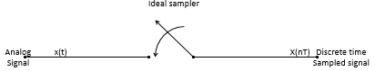

## SAMPLING THEORY

*Signals must be filtered prior to sampling. Theortically the maximum frequency that can be represented is half the sampling frequency. In practice a higher sample rate is used to allow for non-ideal filters.
The signal is now represented at multiples of the sampling period, T, as s(nT) which is also written tex2html_wrap_inline2787.
Telephone speech is sampled at 8 kHz. 16 kHz is generally regarded as sufficient for speech recognition and synthesis. The audio standard is a sample rate of 44.1 kHz (Compact Disc) or 48 kHz (Digital Audio Tape) to represent frequencies up to 20 kHz.*


Figure 1 *The Ideal Sampler*

In an Ideal sampler given in Figure 1 above,* the analog signal is sampled once every T seconds, resulting in a sampled data sequence.  The sampler is assumed to be ideal in that the value of the signal at* any instance (typically *an infinitely small amount of time) is taken.A real sampler, of course, cannot achieve that* and the sampling interval is not exactly even. 

Sampling frequency is meaured in Hertz is the inverse of the sampling period.

$ f_s=\frac{1}{T} $

Sampling frequency size is proportional to the digital signal data size and therefore should be kept to a minimum.  However, if the sampling frequency is to small, the information captured will lose its integrity.  The sampling theory governs the minimum sampling frequency sufficient for adequate optimal capture of analog signals.


The Shanon sampling theorem states that the minimum frequency required to accurately reproduce a signal at least twice highest frequency contained in the original signal (ref). 

*Normally stored in 16 bits, of which 12 are significant. Telephony quality speech is sampled at 8kHz with a 12 bit dynamic range (stored in 8 bits with a non-linear squashing function).*


```python

```
