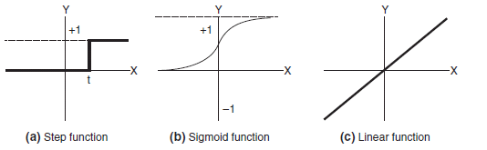
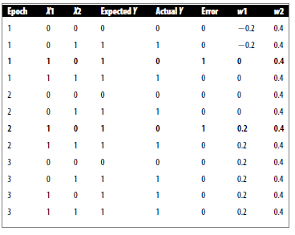
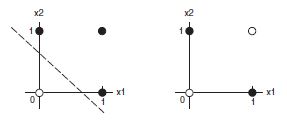

A SURVEY OF ARGUMENT VISUALISATION TOOLS
========================================

ABSTRACT
--------

Argument visualization tools are software visualization tools that, more often than not, illustrate a body of statements also known as arguments in an organized, hierarchy of graphs. This paper compares various analysis made for four common argument visualization tools – Beldevere, ConvinceMe, Reason!Able and Athena. The comparative analysis in this paper establishes a common basis for comparison and discovers unique metrics for comparing distinctive features of the various argument visualization tools explored.

INTRODUCTION & LITERATURE
-------------------------

Scientists, educationists, enterprises, to mention a few, are constantly looking for ways to improve human performance when it comes to making sense of facts, learning and retaining new knowledge. A step taken by researchers towards achieving effective analysis and retention of facts within a body text is through diagramming of concepts contained within the text. One of the commonly used methods is using mind maps which connects related concepts of a domain in an undirected graph (Anderson, 1993). The major advantage of mind map is the inherent hierarchical structure through which it provides a means to correlate concepts within the domain for which it is created and provides a summarized overview of the target domain or subject.

Researchers have taken this concept a step further not only by automating the diagramming process but in addition they are developing software to be part of the diagram formation decision-making process by determining what statements or arguments are relevant concepts to the diagram and also creating new concepts in order to further classify them. van den Braak, Oostendorp, Prakken, & Vreeswijk (2008) describe argument visualization tools as software that support the construction of arguments in various visualization formats such as tables and graphs. Their work took a critical evaluation of the various efforts of software designers towards building automatic argument visualization tools. Here, not only do they evaluate the software but also the experimentation methods used to evaluate the software in order to validate them.

In their analyses, van den Braak et al. (2008) use validity and reliability metrics as the basis to scrutinize the visualization tools, their experiments as well as their results. They define internal validity to be the extent to which the dependent and independent variables interact without external influence and external validity as extent to which results of the experiment are able to scale to real world beyond the samples of subjects included in the experiments. In addition, the reliability of their results were also scrutinized. van den Braak et al. (2008) points that “validity implies reliability but not the the other way around” as such, the concept being measured is accurately measured where validity is concerned, on the other hand, reliability is concerned with the accuracy of the measurement method.

However, van den Braak et al. (2008) analyses were limited by unique features of each software visualization tool. The fact that each of these argument visualization tools can be observed from different design goals and perspectives make them challenging for comparison. Harrell (2005) develops a set of criteria which he establishes as a basis for comparison for the various argument visualization tools. The criteria comprised two classifications. The first classification involved the meta-cognitive process of the argument including how premises, propositions and supporting statements are represented. The second classification leaned towards the user experience of the visualization application. The emphasis for this classification was on the fluidity of the visualization. This includes moveability of the visual elements and the elasticity of the textual elements to resize and contain/wrap text.

This paper takes a middle ground to establish a general basis of comparison from a software design perspective whilst trying to connect with the unique features of each argument visualization tools logical design. In particular, for each visualization tool examined, we will first of all examine the software’s user interface from the perspective of the user and usability metrics, which is a general metric for all visualization tools. Then specifically, we will use software verification and validation(ref) to probe into the particular logical design goals of the unique features of each of the argument visualization tools.

BELVEDERE
---------

Belvedere argument visualization tool is designed specifically to enhance argumentation skills in the science domain. It therefore sets-up arguments for and against hypotheses (Suthers, Weiner, Connelly, & Paolucci, 1995). In terms of internal validity, van den Braak et al. (2008) gave Belvedere a pass mark and summarizes its features as a tool for scientific argument skill enhancement and a collaborative tool that stimulates discussions amongst users. Suthers et al.(1995) identified difficulties students have when discussing and discovering new concepts. It is these difficulties that they assert Beldevere addresses. These difficulties include recognizing abstract relationship between arguments, keeping track of relevant elements of a complex debate, criteria for scientific argumentation, limited domain knowledge and lack of intrinsic motivation. Design goals of Beldevere to solve this problem include using a repository of diagram objects to represent concrete concepts. An advisor is used to keep students on track without deviating from the focus of the discussion. Beldevere provides scientific argumentation criteria by prompting students to support their arguments with empirical evidence statements. A database of common knowledge areas in science is also accessible to the students and customizable by administrators. Finally, by providing concurrent, multi-user access, participants can collaborate on the same topic, thus mental stimulation and motivation is provided by the diagramming solution Beldevere provides.

User interface goals of Beldevere include keeping the user focused on cognitive effort rather than on learning to use the program. Colors can be used to distinguish various view points such as different theories of different users. A free hand drawing tool is provided and labels are used for both links and objects. Graphical shapes have the ability to resize themselves to fit their contents in addition, when a graphical object is moved, its links are retained in order to maintain the logical connection.

Though internally valid, Beldevere strength was also its weakness. The flexibility of Beldevere made it prone to inconsistency of the use of its objects and links. For instance a student can use different objects on the same concept and could therefore easily lose track of the objects true relationship.

CONVICE ME
----------

Convince Me operates by providing a metric on the credibility of inferences drawn by the users based on the arguments the users provide. With the Convince Me tool, nodes represent either evidence or hypothesis. The concept behind of the Convince me tool is based on Thagard’s Explanatory Coherence theory (Thagard, 1997).

Convince Me is a user-friendly tool that uses casual networks and simple nodes designed generally to foster scientific reasoning. Explanatory and contradictory relations are represented by solid or dashed links between the nodes. Convince Me gains its strength from not only the analysis of the users arguments but also by generating new arguments to stimulate reasoning.

*Convince Me is a free and open source Java application used for for generating and analyzing arguments. Convince Me uses a connectionist model, called ECHO, to provide feedback on the coherence of the arguments entered into the application.Convince Me guides people to cyclically (1) categorize their own propositions as either evidence or hypotheses, (2) indicate the reliability of their various evidence, (3) connect their propositions with both explanatory and contradictory/competitive links, and (4) rate each proposition's believability. After each (1-4) cycle, users can elicit feedback from a connectionist model, called ECHO, to help improve the coherence of their arguments. Studies suggest that although the distinguishing characteristics of data and theory are vague, even for experts who study scientific reasoning professionally.Convince Me lends a sophistication to novices' discriminative criteria across contexts, making their epistemic categorizations more expert-like both during, and after, its use. Requirements:*

*· Java*

*What's New in This Release: \[ read full changelog \]*

*· Fixed XML import bug and added XML version of ice cubes argument.*

REASON!ABLE
-----------

Reason!Able is a visualization tool that facilitates the reasoning skills of the user by constructing a mapping tree that guides the user to map arguments to specific attributes (Van Gelder, 2002).

Argument tree nodes in Reason!Able consists of claims, reasons and objections. Reason’s and objectives can give rise to new premises.

ATHENA
------

Athena standard is commended by Harrell (2005) for its versatility when it comes down to argument construction. In terms of its user interface and usability, Athena standard creates argument diagrams by representing arguments found within philosophical texts (Harrell, 2005). With Athena, the user can draw boxes and texts separately and move them around. After linking boxes with lines, the boxes can be further moved about on the screen by dragging and the connected lines will remain intact. The connecting lines can also indicate support or objection by changing the color from default (support) to red (objection). In addition he boxes can also exhibit other attributes to indicate the strength of the argument.

EVALUATION
----------

The designers of software argument visualization tools purport that visualization tools improve reasoning and these claims are not without some logical proof. When compared to textual data, the visualization tools have structure and perform to some extend a level of summarization that would have been cumbersome and time consuming for a human to do. However, the accuracy of the visualization output needs further exploration. In other words, what the argument visualization tools lack are proper metrics to bench mark their performance in relation to their purpose and in relation to each other.

CONCLUSION
----------

Software visualization tools perform a worthy cause in assisting the user to better understand better the information they are attempting to process. Software argument visualization tools attempts to make their users better reasoners. These can perform feats of faster information processing however, the accuracy and relevance of the processed information requires appropriate software verification and validation tools are used to appraise the software’s ability to improve the user’s reasoning.

REFERENCES
==========

Anderson, J. V. (1993). Mind mapping: A tool for creative thinking. *Business Horizons*, *36*(1), 41–46. http://doi.org/10.1016/S0007-6813(05)80102-8

Harrell, M. (2005). Using argument diagramming software in the classroom. *Teaching Philosophy*, *28*(2), 163–177.

Suthers, D., Weiner, A., Connelly, J., & Paolucci, M. (1995). Belvedere: Engaging students in critical discussion of science and public policy issues. In *Proceedings of the 7th World Conference on Artificial Intelligence in Education* (pp. 266–273). Washington, DC. Retrieved from http://lilt.ics.hawaii.edu/papers/1995/suthers-et-al-aied95.pdf

Thagard, P. (1997). Probabilistic Networks and Explanatory Coherence. *Automated Abduction: Inference to the Best Explanation*.

van den Braak, S. W., Oostendorp, H. van, Prakken, H., & Vreeswijk, G. A. (2008). A critical review of argument visualization tools: Do users become better reasoners? In *Workshop Notes of the ECAI-06 Workshop on Computational Models of Natural Argument* (pp. 67–75).

Van Gelder, T. (2002). Argument mapping with reason! able. *The American Philosophical Association Newsletter on Philosophy and Computers*, *2*(1), 85–90.
